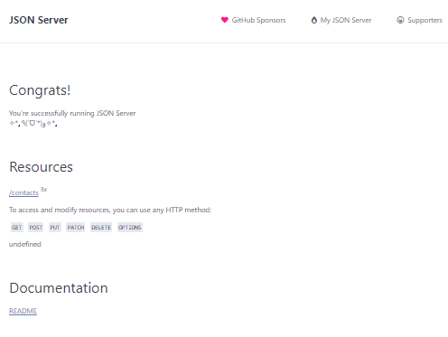

# Contact Manager

In the project directory, you can run:

### `npm start`

Runs the app in the development mode.\
Open [http://localhost:3000](http://localhost:3000) to view it in your browser.

### Set-up JSON server

1. First of all, ensure NodeJS and NPM has installed.
2. Create a folder. For example, I have created with the name: server-api.
3. Run `npm init` inside the folder. It’ll successfully create a package.json file.
4. Run npm install --save json-server. It’ll add the same dependency to the package.json file too. To install json-server globally, run npm install -g json-server. The folder structure looks as follows:
5. Now We need to start our server. To do so, open the package.json file and add a key-value in the scripts object like below.:

        "scripts": {
            "start": "json-server -p 3006 -w db.json"
        }
6. Open the command prompt and navigate to the folder. Run the command:
`npm start`. It’ll run the server locally on `http://localhost:3006`
7. A file named db.json created in the folder, you can create the file with your own data. When the server runs locally, it tries to search for the file (db.json) and if not found, it creates a file on its own with mock JSON data.
8. When you hit `http://localhost:3000`, you should see the following output.

It has predefined 1 resource: contact. These resources are picked from the db.json file.
